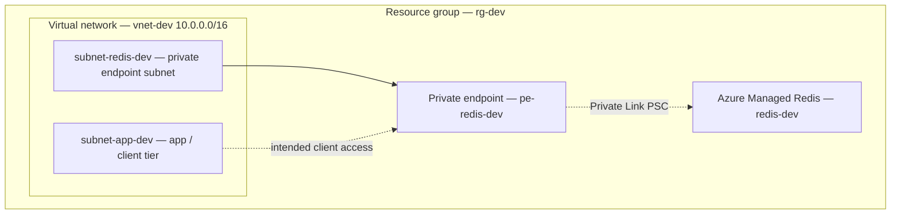

# Azure Managed Redis (Terraform)

Modular **Terraform** layout for **Azure Managed Redis** with supporting networking and **Private Link** plumbing.

# Design Architecture Diagram

## What this demonstrates

- **IaC** with reusable modules and a per-environment root (currently `env/dev`).
- **Networking**: resource group, VNet, and subnets split for workload vs. private endpoint placement.
- **Data**: Azure Managed Redis (`azurerm_managed_redis`) with an example SKU (`Balanced_B2`).
- **Private connectivity**: Private endpoint module targeting Private Link access patterns for Redis traffic inside the VNet.

## Tech stack

| Area          | Choice                                      |
| ------------- | ------------------------------------------- |
| IaC           | Terraform, **azurerm** provider `4.72.0`  |
| State         | Local backend (remote backend planned)      |
| Region        | Configurable (default `southeastasia`)    |
| Data plane    | Azure Managed Redis                         |

## Repository layout

| Path                         | Role                                                      |
| ---------------------------- | --------------------------------------------------------- |
| `env/dev/main.tf`            | Dev root: wires RG, VNet, subnets, Redis, private endpoint |
| `env/dev/variables.tf`       | Root variables (e.g. `location`)                          |
| `module/resource_group`      | Resource group                                            |
| `module/virtual_network`     | Virtual network / address space                           |
| `module/subnet`              | Subnet (reused for app-facing and Redis PE subnets)       |
| `module/managed_redis`       | Azure Managed Redis instance                              |
| `module/private_endpoint`    | Private endpoint + private service connection             |

## Prerequisites

- [Terraform](https://developer.hashicorp.com/terraform/install) **1.x** (compatible with your lockfile under `env/dev/.terraform.lock.hcl`).
- [Azure CLI](https://learn.microsoft.com/en-us/cli/azure/install-azure-cli) and an Azure subscription with rights to create the resources above.
- Optional: an **Azure Storage** account (and IAM) if you later move state to an `azurerm` remote backend.

## Implementation timeline (portfolio build log)

| Date       | Delivered                                                                 |
| ---------- | ------------------------------------------------------------------------- |
| 2026-05-13 | `dev` / `stage` environment split (dev wired); RG, VNet, subnet modules   |
| 2026-05-13 | Managed Redis module, private endpoint module, `readme.md` refresh        |

## Known limitations

- **State**: Root config uses **local state** until Azure portal access is available; switch to a remote backend (for example Azure Storage + state lock) when you can manage cloud-side resources comfortably.
- **`env/stage`**: Stage layout is part of the design direction; add a sibling root under `env/stage` mirroring `env/dev` when you are ready to parameterize it.

## Troubleshooting (local dev)

- **Azure sign-in** — Run `az login` and confirm the intended subscription with `az account show`. Stale sessions or the wrong default subscription are the most common cause of “works on my machine” drift.
- **Provider registration** — This repo sets `resource_provider_registrations = "none"` on the provider. If Terraform reports missing resource providers, either pre-register namespaces in the subscription or relax that setting per [azurerm provider docs](https://registry.terraform.io/providers/hashicorp/azurerm/latest/docs#resource_provider_registrations).
- **Networking / Private Link** — If connectivity to Redis via private endpoint fails, verify subnet delegation requirements for your chosen Redis SKU, DNS (private DNS zones if you add them later), and that the private service connection targets the **Managed Redis resource ID** (not a subnet) in your final wiring.
